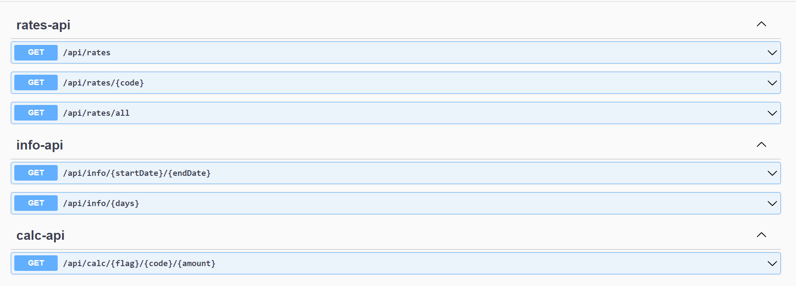
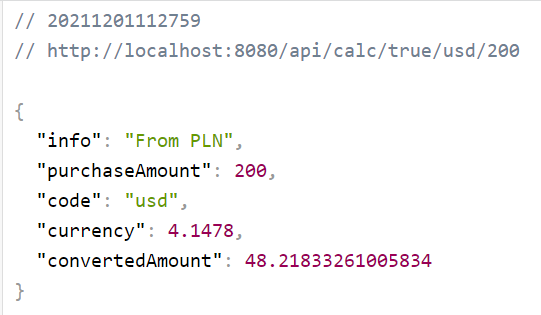

<div id="top"></div>


<!-- PROJECT LOGO -->
<br />
<div align="center">

<h3 align="center">Currency Exchange </h3>

  <p align="center">
    Hi it's SpringBoot based app, Currency Exchange, you can find rates from nbp and calculate some stuff
  </p>
  
</div>

<!-- TABLE OF CONTENTS -->
<details>
  <summary>Table of Contents</summary>
  <ol>
    <li><a href="#built-with">Built With</a></li>
    <li><a href="#getting-started">Getting Started</a></li>
    <li><a href="#installation">Installation</a></li>
    <li><a href="#usage">Usage</a></li>
    <li><a href="#license">License</a></li>
    <li><a href="#contact">Contact</a></li>
  </ol>
</details>


### Built With
<div>


  
</div>

<p align="right">(<a href="#top">back to top</a>)</p>


<!-- GETTING STARTED -->
## Getting Started

This project aims to show a little bit dose of my skils of programming, knowledge about JAVA, OOP, Clean Code and architecture patterns, and mainly about Spring Boot and REST API


### Installation

1. Clone the repo.
   ```sh
   git clone https://github.com/jozefiakBJ/exchange.git
   ```
   
2. Run mySQL and create "new" db schema

4. Run project in IntelliJ 

<p align="right">(<a href="#top">back to top</a>)</p>


<!-- USAGE EXAMPLES -->
## Usage
swagger info(after instalation go localhost:8080) :
<div align="center">
  <a href="https://github.com/github_username/repo_name">
    
    
#some calculated example
</a>
  <div align="center">
  <a href="https://github.com/github_username/repo_name">
    
  </a>
    

<p align="right">(<a href="#top">back to top</a>)</p>

<!-- LICENSE -->
## License

Distributed under the MIT License.

<p align="right">(<a href="#top">back to top</a>)</p>


<!-- CONTACT -->
## Contact

Bartłomiej Jóżefiak - jozefiak.bj@gmail.com

<p align="right">(<a href="#top">back to top</a>)</p>
